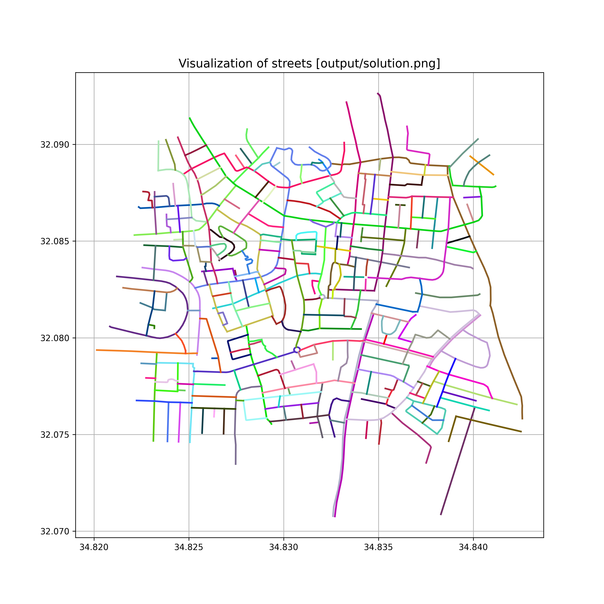

# Brief explanation of the algorithm
The task is to build streets out of random segments, that connect to each other.

## 0 Idea
The main idea of the algorithm is:
1. find **starter segment** - a segment that has neighbour-segments is only one direction
2. chain segment by segment after the **starter segment** until the dead end or other **special** situation
3. such chains will represent streets

## 1 Represent segments as graph
Since work here with neighbours and in my opinion it's a little inconvenient to look for neighbour segments for each segment separately - I've decided to structure those into a graph.

Every vertex of the graph is a segment and every edge represents neighbouring segments.

For example:

Every vertex of the graph also contains information:
- if the vertex was used as part of some street
- if the vertex is a starter segment
- the angle of the segment relative to the horizon

### Find all connections
If two different segments contain same point then assume that they are neighbours.

In other words there is an edge between those segments.

## 2 Find starter segments(verteces)
The **starter segments** can be found by the checking, how many neighbours each end of the segment has.

If at least on of the ends has no neighbours - the segment considered to be starter.

## 3 For each starter segment find best continuance
So there are few variants:
1. if there is only one next-segment
2. if there are two next-segments
3. if there are three or more next-segments

Also there is a variant if there are no next-segments - in this case we assume it's a dead end.

The best next-segment is decided if the difference between angle of current segment and angle of next segment is minimal.

## 4 If all starter segments have been used
Sometimes happens that all starting segments are belong to streets and some regular segments are still not selected.

In this case we find new starting segments, considering segments that already in use.

## 5
Then we cycle through points 3 and 4 until all segments will belong to some street

## 6 Visualize
In the program, each street is a bunch of segments.

So, before printing the street, we choose a color, and then we go through each segment and print it in the selected color.

## Result

